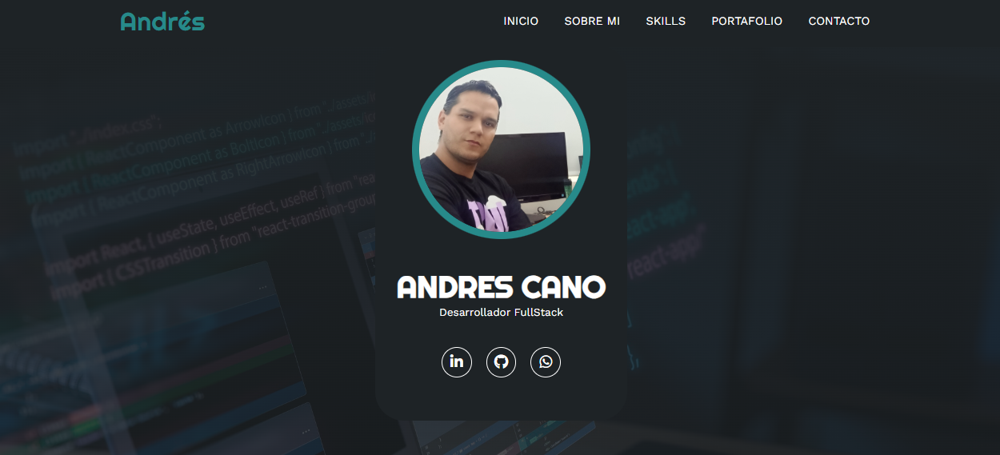

# 🧑‍💻 Portafolio Web - Andrés Cano Rave

Este es mi portafolio personal como **Desarrollador Full Stack**, donde muestro mis habilidades, tecnologías que domino, y formas de contactarme. El diseño es moderno, responsive y pensado para ofrecer una experiencia clara y profesional.

---

## 📸 Vista previa

 

---

## Estructura del proyecto

📦 portafolio/
 ┣ 📁 assets/
 ┃ ┣ 📄 AndresCanoProfile.jpg
 ┃ ┗ 📄 preview.jpg
 ┣ 📄 index.html
 ┣ 📄 style.css
 ┣ 📄 script.js
 ┗ 📄 README.md

---

## 🛠️ Flujo de Trabajo con Ramas

Durante el desarrollo del proyecto, se siguió una estructura de ramas sencilla pero efectiva:

- `dev`: Rama principal de desarrollo. Aquí se implementaron, probaron y ajustaron todas las funcionalidades antes de ser consideradas estables.
- `main`: Rama destinada a producción. Solo se fusionaron a esta rama los cambios previamente validados en `dev`.

Este enfoque permitió mantener el código de producción limpio y libre de errores, facilitando el control de versiones y la colaboración durante el desarrollo.

---

## 🚀 Tecnologías utilizadas

- **HTML5**: Estructura del sitio
- **CSS3**: Estilos personalizados y responsive
- **JavaScript**: Validación de formularios y funcionalidades extra
- **EmailJS**: Envío de formularios directamente a mi correo electrónico
- **Font Awesome**: Íconos visuales y sociales
- **Google Fonts (Quicksand)**: Tipografía moderna y ligera

---

## ✨ Características destacadas

- Diseño totalmente **responsive** (desktop, tablet, móvil)
- Secciones:
  - Banner de bienvenida
  - Sobre mí
  - Proyectos o experiencia
  - Formulario de contacto
  - Footer con enlaces sociales
- Validación de formulario con alertas si hay campos vacíos
- Envío del mensaje directamente a mi correo usando EmailJS
- Código organizado y comentado para facilitar futuras mejoras

---

## 🛠️ Instalación y uso local

1. Clona el repositorio o descarga el ZIP:
```bash
https://github.com/devrave/Portafolio_devrave.git
